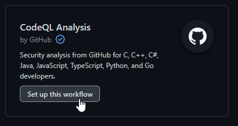
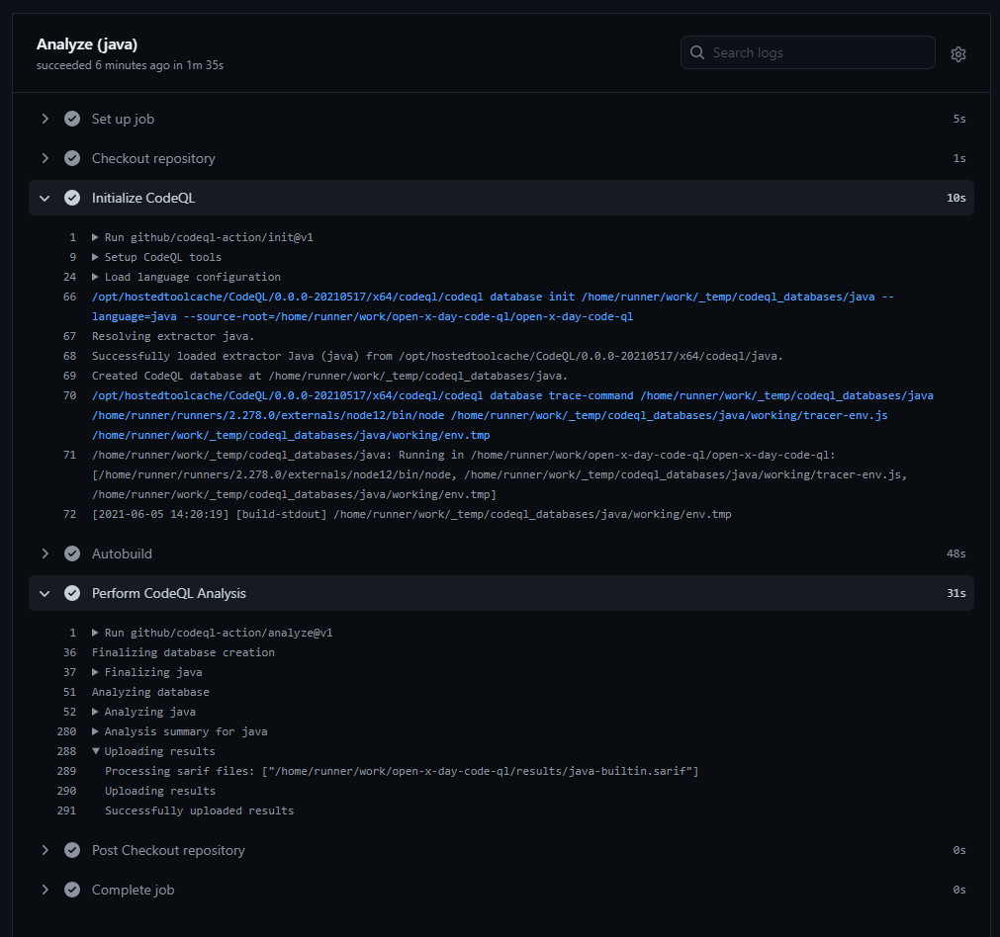
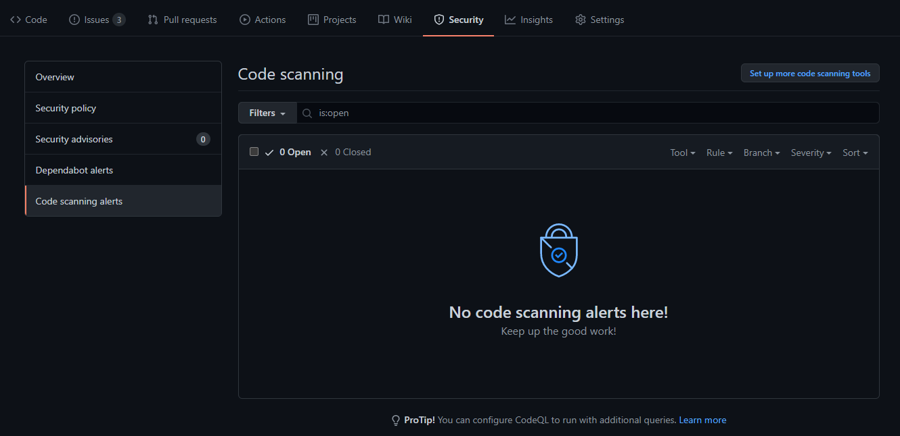

# Agenda
1. [What is CodeQL](#Top1)
2. [Differentiation to Sonarcloud/Sonarqube](#Top2)
3. [Integrated usage in Github](#Top3)
4. [How to use in different CI-evn (e.g. Jenkins)](#Top4)


# <a id="Top1"></a> What is [CodeQL][CodeQL]
> A ___semantic code analysis engine___, which lets you query code as though it were data.
- Available for C, C++, C#, Go, Java, JavaScript and Python
- It is based on SemmleCode, which is an object-oriented query language for deductive databases developed by Semmle.
- Semmle Inc itself is a code-analysis platform provider, that was acquired by GitHub (i.e., Microsoft) on 18 September 2019

### How does it work
- It creates a ___relational representations___ of your source code (i.e., database).
- That database can be queried like any other
  using queries written in a specially-designed, object-oriented [query language][CodeQL] in order to identify likely bugs,
  metrics, performance issues, language abuse ... or any other '__bad__' pattern
  (e.g., [Inefficient String constructor](https://github.com/github/codeql/blob/main/java/ql/src/Performance/NewStringString.ql))
- multiple queries are grouped into [CodeQL Suites][CodeQL Suites]
- [Tutorial][Find the thief] to learn the query language
- Results in JSON formatted [SARIF][SARIF] file, according to [Azure][SARIF Azure]:
  > The Static Analysis Results Interchange Format (SARIF) is an industry standard format for the output of static analysis tools.

# <a id="Top2"></a> Differentiation to Sonarcloud/Sonarqube
- static vs. semantic analysis
- possibility to write and execute own queries
- executable on developer machine using [CLI][CodeQL CLI binaries] (Linux, Windows and OSX)
- perfect integration in VS-Code and Github

# <a id="Top3"></a>Integrated Usage in Github
1. add new Github Action via security tab
   
2. select 'CodeQL Analysis'
   
3. adjust and commit new [action](.github/workflows/codeql-analysis.yml)
4. verify action is running
   
5. Review results
   
   
   

## Demo adding issue to show how its notified
- change App.java to
  ```
  final String x = new String("Hello World!");
  System.out.println(x);
  ```
- ensure query is executed by adjusting config to use suite __security-and-quality__ 
  is currently executing 166 checks (instead of default 31 security relevant checks)
  
- action is succeeding although issues were identified
  
  
  


# <a id="Top4"></a>How to use in own CI (e.g. Jenkins)


[CodeQL]: https://securitylab.github.com/tools/codeql/
[CodeQL references]: https://codeql.github.com/docs/codeql-overview/
[CodeQL Queries]: https://github.com/github/codeql/
[CodeQL Suites]: https://github.com/github/codeql/tree/main/java/ql/src/codeql-suites
[CodeQL CLI binaries]: https://github.com/github/codeql-cli-binaries
[LGTM Query console]: https://lgtm.com/query/rule:1823453799/lang:java/
[Find the thief]: https://codeql.github.com/docs/writing-codeql-queries/find-the-thief/
[SARIF]: http://docs.oasis-open.org/sarif/sarif/v2.0/csprd01/sarif-v2.0-csprd01.html
[SARIF Azure]: https://sarifweb.azurewebsites.net/